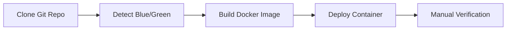
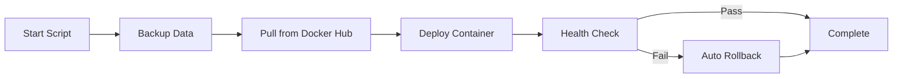

# Deployment Methods Comparison

**Complete comparison of deployment methods for OSCAL Report Generator on TrueNAS**

---

## Overview

The OSCAL Report Generator supports two primary deployment methods for TrueNAS Blue-Green environments:

1. **Build-Based Deployment** (`build_on_truenas.sh`) - Build Docker image locally from source
2. **Pull-Based Deployment** (`deploy_from_dockerhub.sh`) - Pull pre-built image from Docker Hub

This guide helps you choose the right method for your use case.

---

## Quick Comparison Table

| Feature | build_on_truenas.sh | deploy_from_dockerhub.sh |
|---------|---------------------|--------------------------|
| **Deployment Speed** | 🐢 Slow (10-15 minutes) | ⚡ Fast (1-3 minutes) |
| **Internet Required** | 📥 Git clone only (~50MB) | 📥 Docker Hub pull (~400MB) |
| **CPU Usage** | 🔥 High during build | ✅ Minimal |
| **Memory Usage** | 💾 High (1-2GB peak) | ✅ Low (<500MB) |
| **Disk Space** | 💿 Higher (source + build artifacts) | ✅ Lower (image only) |
| **Network Bandwidth** | ✅ Lower (source code) | 📡 Higher (full image) |
| **Customization** | ✅ Full (edit source) | ❌ None (pre-built) |
| **Version Control** | ✅ Any branch/commit | 📌 Published versions only |
| **Use Case** | 🔧 Development, custom builds | 🚀 Production, standard updates |
| **Rollback Method** | 🔄 Manual | ✅ Automatic |
| **Backup** | ⚙️ Via config persistence | ✅ Automatic (API + volume) |
| **Health Verification** | ⚠️ Manual check recommended | ✅ Automatic with timeout |
| **Failure Recovery** | 🛠️ Manual intervention | ✅ Auto-rollback on failure |
| **Risk Level** | ⚠️ Higher (untested build) | ✅ Lower (tested image) |
| **Suitable for Cron** | ✅ Yes (with monitoring) | ✅ Yes (preferred) |
| **Offline Capable** | ⚠️ After initial clone | ❌ No (needs Docker Hub) |
| **Build Consistency** | ⚠️ May vary by environment | ✅ Guaranteed (same image) |
| **Dependencies** | Git, Docker, Node.js build tools | Docker only |
| **First-Time Setup** | ✅ Ideal | ⚠️ Requires published image |

---

## Detailed Comparison

### 1. Build-Based Deployment (`build_on_truenas.sh`)

#### How It Works



#### Workflow Steps

1. Checks prerequisites (Docker, Git)
2. Detects Blue/Green instance from directory
3. Clones/pulls latest code from GitHub
4. Compares versions (current vs remote)
5. Builds Docker image locally with `docker build --no-cache`
6. Stops existing container
7. Starts new container with built image
8. Displays deployment summary

#### Advantages

✅ **Full Source Control**
- Build from any Git branch or commit
- Make local modifications before build
- Useful for testing unreleased features

✅ **Customization**
- Edit source code for specific needs
- Modify Dockerfile for custom configuration
- Add custom dependencies or patches

✅ **Git Branch Flexibility**
- Deploy from `main`, `Development`, or feature branches
- Test specific commits or pull requests
- Useful for development and staging

✅ **Offline After Clone**
- Once cloned, can rebuild without internet
- Useful in restricted networks
- VPN-independent for internal builds

✅ **Build-Time Configuration**
- Custom build arguments
- Environment-specific optimizations
- Modified build timestamps

#### Disadvantages

❌ **Slow Performance**
- 10-15 minutes per deployment
- Multi-stage Docker build process
- npm install and frontend compilation
- Not ideal for quick updates

❌ **High Resource Usage**
- CPU intensive during build
- Memory spike (1-2GB) during compilation
- May affect other TrueNAS services
- Build cache can consume disk space

❌ **Build Variability**
- Slight differences possible between builds
- Dependency version updates
- Environment-specific build issues
- Harder to reproduce exact builds

❌ **No Automatic Rollback**
- Manual intervention required on failure
- Must track previous working version
- Recovery takes additional time

❌ **Manual Verification**
- Need to manually check health
- Monitor logs for errors
- Verify persistence and functionality

#### Best Use Cases

1. **Development Environment**
   - Testing code changes locally
   - Debugging specific issues
   - Iterating on features

2. **Custom Deployments**
   - Organization-specific modifications
   - Integration with custom systems
   - Special compliance requirements

3. **Network Restrictions**
   - Docker Hub blocked or unavailable
   - VPN-only access to GitHub
   - Air-gapped environments (after initial clone)

4. **Specific Version Testing**
   - Testing specific branches
   - Validating pull requests
   - Pre-production verification

5. **First-Time Setup**
   - Initial deployment before images published
   - Custom TrueNAS pool configurations
   - Establishing baseline configuration

#### Example Usage

```bash
# Standard deployment
cd /mnt/pool/OSCAL_Blue
./build_on_truenas.sh

# Force rebuild (skip version check)
./build_on_truenas.sh --force

# Build from Development branch
git checkout Development
git pull origin Development
./build_on_truenas.sh --force
```

---

### 2. Pull-Based Deployment (`deploy_from_dockerhub.sh`)

#### How It Works



#### Workflow Steps

1. Detects Blue/Green instance
2. Checks prerequisites and connectivity
3. Creates deployment lock
4. **Backs up current data** (API + volume)
5. Saves current image for rollback
6. Pulls latest image from Docker Hub
7. Extracts and displays credentials
8. Stops current container
9. Starts new container
10. **Performs health checks** (60-second timeout)
11. Restores configuration and users
12. **Auto-rollback on failure**
13. Cleanup and summary

#### Advantages

✅ **Lightning Fast**
- 1-3 minutes total deployment time
- Only pulls compressed layers
- Resume on network interruption
- Ideal for quick updates

✅ **Automatic Safety**
- Automatic backup before deployment
- Health check verification
- Auto-rollback on failure
- Zero-touch recovery

✅ **Low Resource Usage**
- Minimal CPU usage
- Low memory footprint
- No build overhead
- TrueNAS-friendly

✅ **Guaranteed Consistency**
- Same image for all deployments
- Tested in CI/CD pipeline
- Reproducible deployments
- Known-good configuration

✅ **Production Ready**
- Battle-tested images
- Security scanned
- Multi-architecture support
- Optimized for performance

✅ **Built-in Backup/Restore**
- API-based user export
- Volume directory backup
- Configuration preservation
- Easy disaster recovery

✅ **Deployment Protection**
- Lock mechanism prevents conflicts
- Stale lock detection
- Concurrent deployment prevention

#### Disadvantages

❌ **No Customization**
- Cannot modify source code
- Pre-built configuration only
- Fixed build parameters

❌ **Internet Dependency**
- Requires Docker Hub access
- ~400MB download per deployment
- Rate limits apply (pull limits)
- Network issues block deployment

❌ **Version Constraints**
- Only published versions available
- Cannot deploy unreleased features
- Limited to `latest`, `edge`, or version tags

❌ **Docker Hub Dependency**
- Service must be available
- Account rate limits
- Registry outages affect deployment

#### Best Use Cases

1. **Production Deployments**
   - Monthly scheduled updates
   - Rapid security patches
   - Standard version releases

2. **Blue-Green Updates**
   - Coordinated Blue/Green rollouts
   - Minimal downtime deployments
   - Quick switchover capability

3. **Automated Scheduling**
   - Cron-based deployments
   - Unattended updates
   - Night/weekend maintenance windows

4. **Quick Recovery**
   - Rapid disaster recovery
   - Emergency rollbacks
   - Service restoration

5. **TrueNAS Production**
   - Limited resources
   - Stability priority
   - Minimal maintenance windows

#### Example Usage

```bash
# Standard deployment
cd /mnt/pool/OSCAL_Blue
./scripts/deploy_from_dockerhub.sh

# Force deployment (override lock)
./scripts/deploy_from_dockerhub.sh --force

# Skip API backup (volume only)
./scripts/deploy_from_dockerhub.sh --skip-backup

# Scheduled via cron (Blue - 2nd/4th Sunday)
0 2 8-14,22-28 * 0 cd /mnt/pool/OSCAL_Blue && ./scripts/deploy_from_dockerhub.sh >> /var/log/oscal-blue-deploy.log 2>&1
```

---

## Decision Matrix

### Choose `build_on_truenas.sh` if:

- [ ] You need to modify source code
- [ ] Testing unreleased features or branches
- [ ] Docker Hub is blocked or unavailable
- [ ] First-time setup before images published
- [ ] Development or staging environment
- [ ] Custom build requirements
- [ ] VPN-only access to resources
- [ ] Need specific commit or branch

### Choose `deploy_from_dockerhub.sh` if:

- [x] Production TrueNAS deployment
- [x] Need fast updates (1-3 minutes)
- [x] Want automatic rollback protection
- [x] Scheduled/automated deployments
- [x] Limited TrueNAS resources
- [x] Standard version releases
- [x] Docker Hub is accessible
- [x] Need guaranteed consistency
- [x] Prefer tested, stable images

---

## Hybrid Approach

Many users employ both methods:

### Recommended Strategy

1. **Development Phase**
   - Use `build_on_truenas.sh` for testing
   - Iterate on Green instance
   - Validate changes thoroughly

2. **Production Deployment**
   - Use `deploy_from_dockerhub.sh` for Blue
   - Schedule monthly updates
   - Benefit from automatic rollback

3. **Emergency Patches**
   - Use `deploy_from_dockerhub.sh` for quick updates
   - Fast deployment minimizes downtime
   - Auto-rollback provides safety net

4. **Custom Features**
   - Use `build_on_truenas.sh` for special builds
   - Test in Green environment first
   - Promote to Blue after validation

---

## Performance Benchmarks

### Typical Deployment Times

| Phase | build_on_truenas.sh | deploy_from_dockerhub.sh |
|-------|---------------------|--------------------------|
| Prerequisites | 10s | 10s |
| Git Operations | 30s | - |
| Docker Build | 8-12 min | - |
| Docker Pull | - | 1-2 min |
| Backup | - | 10-20s |
| Container Deploy | 30s | 30s |
| Health Check | Manual | 10-60s |
| Restore Config | Manual | 20s |
| **Total** | **10-15 min** | **1-3 min** |

### Resource Usage

| Resource | build_on_truenas.sh (Peak) | deploy_from_dockerhub.sh (Peak) |
|----------|---------------------------|--------------------------------|
| CPU | 80-100% | 10-20% |
| Memory | 1.5-2GB | 300-500MB |
| Disk I/O | High | Medium |
| Network | Low (50MB) | High (400MB) |

---

## Migration Guide

### From Build to Pull-Based

If you've been using `build_on_truenas.sh` and want to switch:

```bash
# 1. Ensure latest version is deployed and working
./build_on_truenas.sh

# 2. Test pull-based deployment on Green first
cd /mnt/pool/OSCAL_Green
./scripts/deploy_from_dockerhub.sh

# 3. Verify functionality
curl http://localhost:3019/health

# 4. If successful, deploy to Blue
cd /mnt/pool/OSCAL_Blue
./scripts/deploy_from_dockerhub.sh

# 5. Update cron jobs to use new script
crontab -e
# Change: ./build_on_truenas.sh
# To:     ./scripts/deploy_from_dockerhub.sh
```

### From Pull to Build-Based

If Docker Hub becomes unavailable:

```bash
# 1. Ensure you have Git repository access
git clone https://github.com/keekar2022/OSCAL-Reports.git /mnt/pool/OSCAL_Blue

# 2. Build from source
cd /mnt/pool/OSCAL_Blue
./build_on_truenas.sh

# 3. Continue with build-based deployments
# No additional changes needed
```

---

## Troubleshooting

### Build Script Issues

**Problem**: Build takes too long

**Solution**: Use pull-based deployment for faster updates

---

**Problem**: Out of memory during build

**Solution**: 
```bash
# Increase Docker memory limit or use pull-based
# Or build with fewer parallel jobs
docker system prune -a
./build_on_truenas.sh
```

---

### Pull Script Issues

**Problem**: Cannot reach Docker Hub

**Solution**:
```bash
# Check connectivity
ping hub.docker.com

# Alternative: Use build script
./build_on_truenas.sh
```

---

**Problem**: Rate limit exceeded

**Solution**:
```bash
# Wait 6 hours or authenticate with Docker Hub
docker login
./scripts/deploy_from_dockerhub.sh
```

---

## Summary

Both deployment methods are valid and serve different purposes:

- **Use `build_on_truenas.sh`** for customization, development, and testing
- **Use `deploy_from_dockerhub.sh`** for production, automation, and quick updates

The pull-based deployment script is recommended for most TrueNAS production environments due to its speed, safety features, and automatic rollback capabilities.

---

## Related Documentation

- [Docker Hub Guide](./DOCKER_HUB_GUIDE.md)
- [TrueNAS Installation](./TRUENAS_INSTALLATION.md)
- [Deployment Guide](./DEPLOYMENT.md)
- [Architecture](./ARCHITECTURE.md)

---

**Last Updated**: January 2026  
**Maintained By**: Mukesh Kesharwani  
**Version**: 1.6.4
