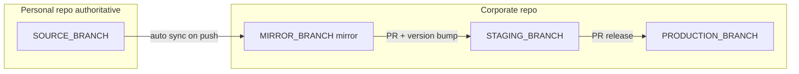

<!--
concept: Mukesh Kesharwani
contact: mukesh.kesharwani@adobe.com
-->

# Dual-Repo Quality Mirror Playbook

Portable guide for implementing **personal authoritative development → corporate mirror → staging → production** across two GitHub repositories. Written so a Cursor agent (or engineer) can apply the same pattern in another project by replacing placeholders and following the checklists.

**Origin:** Implemented in OSCAL Report Generator (`keekar2022/OSCAL-Reports` → `AdobeManagedServices/OSCAL-Reports`) on 2026-06-29.

**Related in-repo docs:** [GIT_AND_RELEASE.md](GIT_AND_RELEASE.md) (day-to-day workflow), [VALIDATION_SYSTEM.md](VALIDATION_SYSTEM.md).

---

## 1. Problem this solves

| Problem | Cause | Fix in this playbook |
|---------|--------|----------------------|
| CI fails: `VERSION CHECK FAILED — bump with ./scripts/bump_version.sh` | `package.json` version **equals** latest git tag (e.g. both `1.7.22`) after Dependabot merges without a bump | Bump version **only** when promoting to staging; do not require bump on mirror sync |
| Two repos drift apart | Manual commits on corporate `Development` + ad hoc merges | **One authoritative branch** on personal repo; corporate branch is **mirror-only** |
| Sync automation fails | Wrong target branch, expired PAT, private personal repo 404 | Adobe-side **pull** sync + `repository_dispatch` + secrets checklist |
| Dependabot on corporate repo re-breaks version gate | Bot merges to staging without bump | Run Dependabot on **personal** repo only; promote via PR |

---

## 2. Target architecture (customize placeholders)

Replace these in every file and command:

| Placeholder | OSCAL Reports example | Your project |
|-------------|----------------------|--------------|
| `PERSONAL_ORG/REPO` | `keekar2022/OSCAL-Reports` | e.g. `myuser/my-app` |
| `CORPORATE_ORG/REPO` | `AdobeManagedServices/OSCAL-Reports` | e.g. `MyOrg/my-app` |
| `SOURCE_BRANCH` | `Quality` | Branch where **all** dev work happens on personal repo |
| `MIRROR_BRANCH` | `Quality` | Same name recommended on corporate repo |
| `STAGING_BRANCH` | `Pre_Prod` | Staging + version validation + auto-tag |
| `PRODUCTION_BRANCH` | `Prod` | Production (or `main`) |
| `VERSION_FILE` | root `package.json` `"version"` | Any single source of truth for semver |
| `BUMP_SCRIPT` | `./scripts/bump_version.sh` | Project’s version bump script |



**Rules**

1. **Never** commit application code directly to corporate `MIRROR_BRANCH` (automation only).
2. **Retire** corporate `Development` (or equivalent) — it duplicates personal work.
3. **Dependabot / quality bots:** personal repo first; mirror propagates commits.
4. **Version bump:** required when opening PR `MIRROR_BRANCH` → `STAGING_BRANCH`, not on every mirror push.
5. **`repository_dispatch` workflows** must exist on the corporate repo **default branch** (often `STAGING_BRANCH`).

---

## 3. What we implemented in OSCAL Reports (session log)

Use this as a reference for scope and order of operations.

### Phase A — Fix version-check CI failure

- **Symptom:** Adobe PreProd Validation failed: `CURRENT="1.7.22"`, `LATEST="1.7.22"`.
- **Cause:** Tag `v1.7.22` existed; Dependabot merged to `Pre_Prod` without bumping version.
- **Fix:** Merged personal `Quality` (v1.7.23) into Adobe `Pre_Prod` via PR #84; validation passed (`1.7.23 > v1.7.22`).

### Phase B — Full sync laptop, personal, and Prod

- Fast-forwarded local/personal `Quality` to Adobe `Pre_Prod`.
- Created personal mirror branches: `Pre_Prod`, `Prod`, updated `Development`.
- Merged Adobe `Pre_Prod` dependabot commits into personal `Quality`.
- PR #85: Adobe `Pre_Prod` → `Development`.
- Validation: backend unit tests (39 suites), frontend build, PDF export smoke.
- PR #86: Adobe `Pre_Prod` → `Prod` (v1.7.16 → v1.7.23).

### Phase C — Quality mirror (replace Adobe Development)

- **Removed:** `.github/workflows/sync-personal-quality-to-adobe-preprod.yml` (direct sync to `Pre_Prod`).
- **Added:** `sync-personal-quality-to-adobe-quality.yml`, `dispatch-adobe-quality-sync.yml`, `scripts/git/ff-sync-adobe-from-personal-quality.sh`.
- **Deleted:** Adobe `Development` branch.
- **Created:** Adobe `Quality` branch (mirror).
- **Bumped:** v1.7.24; PR #88 `Quality` → `Pre_Prod` (merged) — puts workflows on default branch.
- **Pending manual:** Refresh `PERSONAL_REPO_READ_TOKEN` on Adobe; add `ADOBE_REPO_DISPATCH_TOKEN` on personal.

---

## 4. Agent implementation checklist

Copy this section into another project’s Cursor task. Execute in order.

### 4.1 Discover current state

```bash
git remote -v
git fetch --all --prune

# Compare tips (adjust branch names)
git log -1 --oneline personal/SOURCE_BRANCH
git log -1 --oneline corporate/STAGING_BRANCH
git log -1 --oneline corporate/MIRROR_BRANCH 2>/dev/null || echo "MIRROR_BRANCH missing"

# Version vs tag on corporate staging
grep '"version"' package.json | head -1
git tag -l "v*.*.*" --sort=-v:refname | head -3

# Diff scope
git diff --stat personal/SOURCE_BRANCH..corporate/STAGING_BRANCH | tail -5
```

### 4.2 Add fast-forward sync script

Create `scripts/git/ff-sync-corporate-from-personal.sh` (adapt from OSCAL):

- Env: `PERSONAL_REPO_READ_TOKEN`, `PERSONAL_REPO_FULL_NAME`, `PERSONAL_BRANCH`, `CORPORATE_TARGET_BRANCH`.
- `git fetch personal "$PERSONAL_BRANCH"`.
- If corporate target branch exists: `git checkout` + `git merge --ff-only personal/$PERSONAL_BRANCH`.
- Else: `git checkout -B "$CORPORATE_TARGET_BRANCH" personal/$PERSONAL_BRANCH`.
- `chmod +x` the script.

### 4.3 Corporate workflow — pull mirror

Create `.github/workflows/sync-personal-to-corporate-mirror.yml`:

- **Name:** `Sync SOURCE_BRANCH to Corporate MIRROR_BRANCH`
- **`on`:**
  - `repository_dispatch`: `types: [quality-sync]` (rename event if you prefer)
  - `workflow_dispatch`
  - `schedule`: `cron: '30 * * * *'` (hourly safety net)
- **`if`:** `github.repository == 'CORPORATE_ORG/REPO'`
- **Steps:**
  1. `actions/checkout@v7` with `fetch-depth: 0`
  2. PAT preflight (HTTP 200 on `GET /repos/PERSONAL_ORG/REPO`)
  3. Run ff-sync script with `CORPORATE_TARGET_BRANCH=MIRROR_BRANCH`
  4. `git push origin MIRROR_BRANCH`
- **Secrets:** `PERSONAL_REPO_READ_TOKEN`, optional `CORPORATE_REPO_PUSH_TOKEN`
- **Var (optional):** `PERSONAL_SOURCE_REPO` = `PERSONAL_ORG/REPO`

Guard every job with `github.repository == 'CORPORATE_ORG/REPO'` so the same file can live in both repos without duplicate runs.

### 4.4 Personal workflow — dispatch on push

Create `.github/workflows/dispatch-corporate-mirror-sync.yml`:

- **`on`:** `push` to `SOURCE_BRANCH`, `workflow_dispatch`
- **`if`:** `github.repository == 'PERSONAL_ORG/REPO'`
- **Step:** `POST /repos/CORPORATE_ORG/REPO/dispatches` with `event_type: quality-sync`
- **Secret:** `CORPORATE_REPO_DISPATCH_TOKEN` (PAT with `repo` on corporate repo)
- If secret missing: log warning and `exit 0` (do not fail the push)

### 4.5 Retire old sync paths

- Delete workflows that pushed personal branch **directly to STAGING_BRANCH** (bypasses version gate and causes drift).
- Remove self-hosted runner push jobs unless you still need them as fallback.
- Delete corporate `Development` after cutover (confirm no open PRs: `gh pr list --base Development`).

### 4.6 Update CI branch filters

On **personal** repo workflows (`quality-gates.yml`, `shell-validation.yml`, etc.):

- Remove corporate-only branch names from filters if unused.
- Ensure `SOURCE_BRANCH` is in `push` / `pull_request` `branches` lists.
- Keep `if: github.repository == 'PERSONAL_ORG/REPO'` on jobs that should not run on corporate.

### 4.7 Version validation (corporate staging)

Typical pattern (OSCAL: `.github/workflows/adobe-preprod-validate.yml`):

- Read `VERSION_FILE` → `CURRENT`
- Latest tag `v*.*.*` → `LATEST`
- **Pass** if `CURRENT > LATEST` (semver compare)
- **Fail** if `CURRENT == LATEST` or `CURRENT < LATEST`

**Important:** Mirror sync to `MIRROR_BRANCH` must **not** trigger this check. Scope the workflow to PR/push on `STAGING_BRANCH` only.

When promoting mirror → staging:

```bash
./scripts/bump_version.sh patch "Promote MIRROR to STAGING"
git push personal SOURCE_BRANCH   # updates mirror via automation
# Open PR corporate MIRROR_BRANCH → STAGING_BRANCH
```

### 4.8 Cutover sequence

1. Commit workflow + script changes on personal `SOURCE_BRANCH`.
2. `git push personal SOURCE_BRANCH`
3. Create corporate `MIRROR_BRANCH`: `git push corporate SOURCE_BRANCH:refs/heads/MIRROR_BRANCH`
4. Merge workflow files onto **corporate default branch** (via PR `MIRROR` → `STAGING` with version bump if needed).
5. Configure secrets (section 5).
6. Test: `gh workflow run "Sync …" --repo CORPORATE_ORG/REPO --ref STAGING_BRANCH`
7. Delete corporate `Development`.

### 4.9 Promotion to production

```bash
# After staging validation green
gh pr create --repo CORPORATE_ORG/REPO \
  --base PRODUCTION_BRANCH --head STAGING_BRANCH \
  --title "release: promote STAGING to PRODUCTION"
```

Use `--admin` only if branch policy blocks merge after all checks pass.

### 4.10 Personal repo mirrors (optional backup)

Push corporate tips back to personal for disaster recovery:

```bash
git push personal corporate/STAGING_BRANCH:refs/heads/STAGING_BRANCH
git push personal corporate/PRODUCTION_BRANCH:refs/heads/PRODUCTION_BRANCH
```

Use `--no-verify` only when pre-push hook blocks mirror push to a protected branch name on personal (same version as tag).

---

## 5. Secrets and tokens

| Location | Secret | Owner | Scopes / access |
|----------|--------|-------|-----------------|
| Corporate repo | `PERSONAL_REPO_READ_TOKEN` | Personal GitHub user | Read private personal repo; **Authorize SSO** if org uses SAML |
| Corporate repo | `CORPORATE_REPO_PUSH_TOKEN` (optional) | Corporate user/bot | `contents:write` if `GITHUB_TOKEN` blocked by branch rules |
| Personal repo | `CORPORATE_REPO_DISPATCH_TOKEN` | Corporate or personal PAT | `repo` on corporate repo |

**Verify personal token (run locally or in CI):**

```bash
curl -sS -o /dev/null -w '%{http_code}\n' \
  -H "Authorization: Bearer $PERSONAL_REPO_READ_TOKEN" \
  -H "Accept: application/vnd.github+json" \
  "https://api.github.com/repos/PERSONAL_ORG/REPO"
# Expect: 200
```

**Common failure:** `Repository not found` on `git fetch` — token lacks access to **private** personal repo or SSO not authorized.

---

## 6. Branch protection recommendations

| Branch | Repo | Policy |
|--------|------|--------|
| `SOURCE_BRANCH` | Personal | Normal dev; require quality gates |
| `MIRROR_BRANCH` | Corporate | Block human pushes; allow GitHub Actions |
| `STAGING_BRANCH` | Corporate | Require PR, version validation, reviews |
| `PRODUCTION_BRANCH` | Corporate | Require PR from staging only |

---

## 7. Pre-push hook pattern (optional)

OSCAL uses `.githooks/pre-push` to enforce version increment only when pushing to `Pre_Prod` or `main` — **not** when pushing mirror branches on personal.

When mirroring to personal branch names that match staging (`Pre_Prod`), use:

```bash
git push --no-verify personal corporate/STAGING:refs/heads/STAGING
```

Prefer adjusting hook to exclude personal mirror pushes rather than disabling hooks globally.

---

## 8. Validation before production

Run on the commit that will be promoted:

```bash
# Example — adapt to project
cd backend && npm ci && npm run test:unit
cd frontend && npm ci && npm run build
./test_cases/scripts/run-all-tests.sh --skip-catalogue-fetch   # if present
```

Corporate CI (on PR to staging): version check, changelog, package consistency, CodeQL, org-specific gates.

---

## 9. Troubleshooting

| Symptom | Likely cause | Action |
|---------|--------------|--------|
| `VERSION CHECK FAILED` | `package.json` version == latest tag | `bump_version.sh patch` on promotion PR |
| `Repository not found` on sync | Bad/expired `PERSONAL_REPO_READ_TOKEN` | New PAT from personal user + SSO authorize |
| `repository_dispatch` never runs | Workflow not on **default branch** of corporate repo | Merge workflow via PR to default branch |
| `could not find workflow` | Workflow only on feature branch | Run with `--ref STAGING_BRANCH` after merge |
| Sync pushes rejected (non-FF) | Corporate mirror has extra commits | Reset mirror to personal tip (one-time); then enforce mirror-only |
| Dependabot breaks staging again | Bot merges on corporate repo | Disable Dependabot on corporate; use personal only |
| Adobe Validation Summary pass but Version Increment fail | Summary job does not fail the workflow | Treat Version Increment as required for staging merges |

---

## 10. Files to copy or adapt from OSCAL Reports

| Path | Purpose |
|------|---------|
| `.github/workflows/sync-personal-quality-to-adobe-quality.yml` | Corporate pull mirror |
| `.github/workflows/dispatch-adobe-quality-sync.yml` | Personal dispatch |
| `scripts/git/ff-sync-adobe-from-personal-quality.sh` | FF merge script |
| `.github/workflows/adobe-preprod-validate.yml` | Staging validation (corporate-only guards) |
| `.githooks/pre-push` | Version gate on staging/production push |
| `scripts/bump_version.sh` | Semver + changelog bump |

When copying to another project, replace:

- `AdobeManagedServices/OSCAL-Reports` → `CORPORATE_ORG/REPO`
- `keekar2022/OSCAL-Reports` → `PERSONAL_ORG/REPO`
- Branch names if not using `Quality` / `Pre_Prod` / `Prod`
- Git author in workflow `git config` lines

---

## 11. Cursor agent prompt (paste into another project)

```text
Implement the dual-repo Quality mirror pattern from docs/DUAL_REPO_QUALITY_MIRROR_PLAYBOOK.md (or the attached copy).

Corporate repo: CORPORATE_ORG/REPO
Personal repo: PERSONAL_ORG/REPO
Source branch (personal): SOURCE_BRANCH
Mirror branch (corporate): MIRROR_BRANCH (same name as SOURCE_BRANCH recommended)
Staging: STAGING_BRANCH
Production: PRODUCTION_BRANCH

Tasks:
1. Add ff-sync script and both GitHub workflows (corporate pull + personal dispatch).
2. Remove any workflow that syncs directly to STAGING_BRANCH.
3. Update personal CI branch filters to use SOURCE_BRANCH only (drop unused Development).
4. Document secrets: PERSONAL_REPO_READ_TOKEN, CORPORATE_REPO_DISPATCH_TOKEN.
5. Do not commit to corporate MIRROR_BRANCH manually — automation only.
6. Bump version only on PR MIRROR → STAGING using the project bump script.

Verify: personal push triggers dispatch; corporate mirror fast-forwards; staging version check passes after bump.
```

---

## 12. OSCAL Reports current state (after 2026-06-29)

| Branch | Personal | Adobe |
|--------|----------|-------|
| Quality | `fc62c0d` (v1.7.24) authoritative | `fc62c0d` mirror |
| Pre_Prod | mirror optional | `d41631d` (PR #88 merge) |
| Prod | mirror | v1.7.23+ via PR #86 |
| Development | legacy / avoid | **deleted** |

**Open manual step:** Fix `PERSONAL_REPO_READ_TOKEN` on Adobe repo for automated mirror sync.

---

## 13. Version history of this playbook

| Date | Change |
|------|--------|
| 2026-06-29 | Initial playbook: version-check fix, full sync, Quality mirror, PR #84–#88 |
