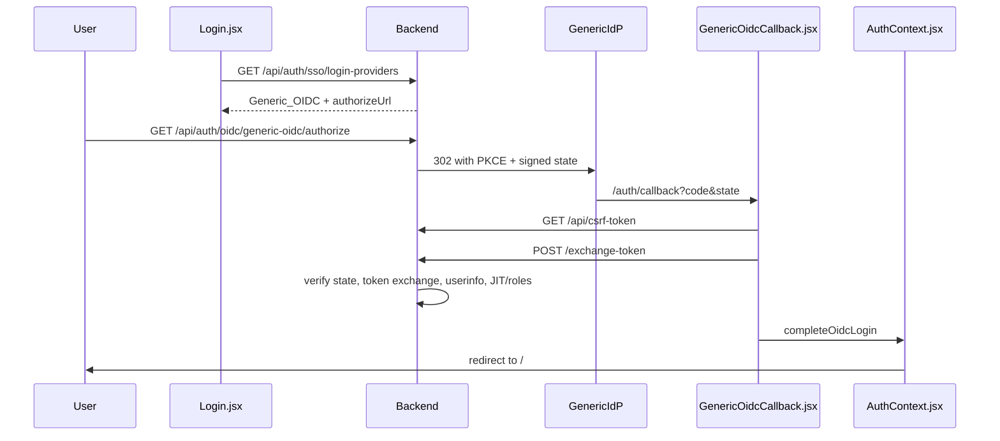

# Okta SSO and OIDC Integration

Step-by-step guide for **Okta SSO integration**, **Generic SSO (`Generic_OIDC`)**, and **role inheritance from IdP groups** for the OSCAL SOA/SSP/CCM Generator. Covers the **amsgovcloud.com.au** deployment and other environments (e.g. keekar.3utilities.com, local development).

**Portability:** The **Generic SSO** patterns documented in [section 3](#generic-sso-generic_oidc--implementation-reference) are **IdP-agnostic** (Authentik is the reference IdP in this repo). You can copy the same frontend/backend flow, security controls, and checklists to other Node/React projects by replacing placeholders (discovery URL, client ID, redirect patterns, group names).

---

## Table of Contents

1. [What You Get](#what-you-get)
2. [Best practices adopted in this project](#best-practices-adopted-in-this-project)
3. [Generic SSO (`Generic_OIDC`) — implementation reference](#generic-sso-generic_oidc--implementation-reference)
   - [When to use Generic SSO vs Okta](#when-to-use-generic-sso-vs-okta)
   - [End-to-end flow](#end-to-end-flow)
   - [IdP setup (admin console)](#idp-setup-admin-console--not-app-code)
   - [Frontend implementation](#frontend-implementation)
   - [Backend implementation](#backend-implementation)
   - [API contract](#api-contract)
   - [Configuration reference](#configuration-reference)
   - [Admin UI](#admin-ui-settings--sso-integration)
   - [TLS and tlsRelaxed](#tls-and-tlsrelaxed-1721)
   - [Portable checklist — implement in another project](#portable-checklist--implement-in-another-project)
   - [Generic SSO verification checklist](#generic-sso-verification-checklist)
4. [Application URLs by Environment](#application-urls-by-environment)
5. [Where to Do What – Quick Map](#where-to-do-what--quick-map)
6. [Okta Admin Console – Application](#okta-admin-console--application)
7. [Okta Admin Console – Groups Claim (for role inheritance)](#okta-admin-console--groups-claim-for-role-inheritance)
8. [OSCAL App – SSO Settings](#oscal-app--sso-settings)
9. [Groups Claim & Role Mapping](#groups-claim--role-mapping)
10. [Checklist & Verification](#checklist--verification)
11. [Troubleshooting](#troubleshooting)
12. [Chrome "Dangerous site" / Safe Browsing warning](#chrome-dangerous-site--safe-browsing-warning)
13. [References](#references)

---

## What You Get

- **SSO (Okta):** Users sign in with Okta on production / EC2 deployments (no app password).
- **SSO (Generic):** Users sign in with **"Sign in with Generic SSO"** on local laptop and Docker when `Generic_OIDC` is enabled (reference IdP: Authentik at `sso.keekar.au`).
- **Role inheritance:** App role (Platform Admin, Assessor, User) is derived from **IdP group membership** (Okta or Generic) and synced on every login when configured.
- **JIT (optional):** New users can be auto-created on first sign-in with a default or group-derived role.

**Okta login flow:** User clicks "Sign in with Okta" → redirect to Okta → sign-in → redirect back to app with authorization code → app exchanges code for tokens and creates a session.

**Generic SSO login flow:** User clicks "Sign in with Generic SSO" → backend authorize route → redirect to IdP → sign-in → redirect to `/auth/callback` → frontend exchanges code server-side → app session created. See [End-to-end flow](#end-to-end-flow) for the full sequence.

---

## Best practices adopted in this project

This section summarizes the **SSO/OIDC patterns and best practices** implemented in the OSCAL Report Generator. They align with OWASP, OAuth 2.0 / OIDC standards, and operational security.

### OAuth 2.0 / OIDC security

| Practice | Implementation |
|----------|-----------------|
| **Authorization Code flow only** | No implicit flow; the app uses `response_type=code` and exchanges the code for tokens server-side. |
| **PKCE (RFC 7636)** | Every authorize request sends `code_challenge` (S256) and `code_challenge_method=S256`. At token exchange, `code_verifier` is sent. Required when Okta has "Require PKCE" enabled; harmless otherwise. |
| **State parameter (CSRF)** | State is **signed** (HMAC-SHA256 with client secret). Payload includes `redirect_uri`, `code_verifier`, and timestamp. Validated at callback; works across server restarts and load-balanced instances without a shared store. |
| **Redirect URI binding** | The callback uses the `redirect_uri` from the validated state (or config). Must match exactly what was sent to Okta (no trailing slash, same scheme/host/path). |
| **Scopes** | Default requested scope is `openid profile email`. The app does **not** require a `groups` scope; Okta can include the groups claim with **Include in: Always** to avoid scope misconfiguration. |

### Groups and role mapping

| Practice | Implementation |
|----------|-----------------|
| **Groups from multiple sources** | Groups are merged from **userinfo** response, **access token** JWT, and **ID token** JWT. Okta often puts groups only in tokens; the backend merges all sources so role resolution works regardless. |
| **Highest-privilege role** | When multiple Okta groups map to different app roles, the app assigns the **highest** role (Platform Admin > Assessor > User). |
| **Case-insensitive group match** | Group names in the mapping are matched case-insensitively against IdP group names. |
| **Sync role on every login** | Optional "Sync role from Okta groups on every login" updates the user’s app role on each sign-in from current group membership (configurable in Settings). |

### Group-to-role mapping interface (Settings → SSO Integration)

- **Add mapping:** Enter Okta group name and select app role (User, Assessor, Platform Admin); add multiple rows.
- **Edit:** Change group name or role per row.
- **Remove:** Per-row "Remove" to delete a mapping.
- **Default role for new users:** Used when no group matches or groups claim is missing (e.g. User, Assessor, Platform Admin).
- **JIT provisioning & role:** Toggle "Enable JIT provisioning"; "Default role for new users"; "Sync role from Okta groups on every login."

### JIT (just-in-time) provisioning

| Practice | Implementation |
|----------|-----------------|
| **Optional JIT** | Configurable in Settings → SSO Integration. When enabled, users not in the app’s user list are created on first sign-in. |
| **Default role** | Configurable (User, Assessor, Platform Admin). Used for JIT-created users when no group matches. |
| **Group-derived role** | JIT-created users get the role resolved from Okta groups (same mapping as existing users). |
| **Reactivation** | If an existing user is deactivated, successful Okta sign-in (with JIT or pre-existing user) can reactivate the account. |
| **Audit** | JIT-created users are tagged with `createdVia: 'oidc-jit'` for traceability. |

### Client secret and sensitive config

| Practice | Implementation |
|----------|-----------------|
| **Encrypted config (_cfgenc)** | Default for local/Docker: saving secrets in the GUI writes `{ "_cfgenc": "v1$..." }` to config (requires `OSCAL_CONFIG_FIELD_SECRET` or `SESSION_SECRET`). |
| **AWS SM (EC2)** | Production uses `{ "_sm": "..." }` pointers; secrets live in the SM bundle. Saves fail if SM is unavailable. |
| **Legacy pass (optional)** | `_pass` pointers are migrated to `_cfgenc` or SM on startup; pass sync scripts are operator-only. |
| **API masking** | Client secrets are never returned to the client; the Settings API returns masked values or placeholders. |

---

## Generic SSO (`Generic_OIDC`) — implementation reference

Release **1.7.20** adds a built-in OIDC provider **`Generic_OIDC`** for any standards-compliant IdP. **Authentik** at `sso.keekar.au` is the reference deployment in this repo. Use Generic SSO on **local laptop** and **Docker** where Okta is not the primary IdP. **EC2 (AMS Gov Cloud)** continues to use **Okta**; `Generic_OIDC` may still appear in config but production sign-in is Okta-first.

This section documents **how the "Sign in with Generic SSO" button and integration are implemented** so you can reuse the pattern in other projects.

### When to use Generic SSO vs Okta

| Context | Primary IdP |
|---------|-------------|
| Local laptop, Docker, homelab | `Generic_OIDC` (e.g. Authentik at `sso.keekar.au`) |
| EC2 / AMS Gov Cloud production | Okta (`Generic_OIDC` optional in config; not primary) |

### End-to-end flow

**Key design choices:**

| Choice | Rationale |
|--------|-----------|
| Login button is a plain `<a href={authorizeUrl}>` | Full browser navigation to the backend authorize route; no SPA fetch on click. |
| Token exchange is **server-side** | Client secret and PKCE verifier never leave the backend. |
| Callback is a **frontend route** (`/auth/callback`) | IdP redirects to the SPA; the callback component POSTs code+state to the backend. |
| Signed state is **stateless** | HMAC payload embeds `redirect_uri` and `code_verifier`; survives server restarts without Redis. |

### Login page layout (1.7.20+)

| Area | Behaviour |
|------|-----------|
| **Upper form** | Username/password, **Sign in with Okta** (when Okta is enabled). |
| **Lower panel** | **Sign in with Generic SSO** (orange button) when `Generic_OIDC` is enabled, followed by access-policy text (15-user cohort, 30-day dormancy). |
| **Expedited entry (optional)** | Shown only when **not** on EC2 (`showExpeditedAccessPolicy` from `GET /api/auth/sso/login-providers`; false when `OSCAL_SECRETS_MODE=aws-sm`). |

### IdP setup (admin console — not app code)

The application is an **OAuth 2.0 / OIDC client only**. It does **not** call IdP Admin APIs to create applications, groups, or claims. All IdP configuration is done in the IdP admin console (or separate authorized automation).

**For Authentik (reference):**

1. Create an **OAuth2/OpenID Provider** and **Application** for your app.
2. Set **Redirect URI** to `{origin}/auth/callback` for each deployment host (must match `callbackPath` and `redirectUriPatterns` in config).
3. Note **Client ID** and **Client Secret** — enter in `config/app/config.json` (or env).
4. Ensure the **`groups` claim** is emitted in userinfo and/or access/ID token JWTs so role mapping works.
5. Copy the **discovery URL** (`.well-known/openid-configuration`) into config.

**Redirect URI example:** `http://localhost:3021/auth/callback` (local), `https://oscal.keekar.au/auth/callback` (Docker/homelab).

### Frontend implementation

| File | Responsibility |
|------|----------------|
| `frontend/src/components/Login.jsx` | On mount, `GET /api/auth/sso/login-providers`; renders **"Sign in with Generic SSO"** when a provider with `id === 'Generic_OIDC'` is returned. |
| `frontend/src/components/GenericOidcCallback.jsx` | Handles `/auth/callback`; fetches CSRF token, POSTs `{ code, state }` to exchange-token, calls `completeOidcLogin`, redirects to `/`. |
| `frontend/src/App.jsx` | Routes unauthenticated users on `/auth/callback` to `GenericOidcCallback`. |
| `frontend/src/contexts/AuthContext.jsx` | `completeOidcLogin(user, token)` stores `sessionToken` and `user` in `localStorage`; subsequent API calls use Bearer auth. |
| `frontend/src/utils/safeAxios.js` | Shared Axios instance with CRLF header validation for all frontend API calls. |

**Button behaviour:** The Generic SSO label is **hardcoded** as `"Sign in with Generic SSO"` in `Login.jsx`. The `displayName` field from config (default `"Generic SSO"`) is shown in **Settings → SSO Integration** but **not** on the login button. Okta uses dynamic `displayName` on its button — porters may wire `genericProvider.displayName` the same way if desired.

**Error handling on login page:** Query param `?error=generic_oidc_not_configured` shows: *"Generic SSO is not configured or the redirect URI is not allowed for this host."*

### Backend implementation

| File | Responsibility |
|------|----------------|
| `backend/auth/genericOidc.js` | PKCE (S256), signed state (HMAC-SHA256, 15 min TTL), OIDC discovery, redirect URI allowlist (strict + regex), token exchange, JWT group decode, client secret resolution. |
| `backend/server.js` | Routes: `login-providers`, `authorize`, `exchange-token`; rate limit on exchange (20 req / 15 min). |
| `backend/auth/userManager.js` | `findOrCreateOidcUser()` — JIT provisioning, group→role (highest privilege), session creation. |
| `backend/utils/defaultOidcGroupRoleMapping.js` | Default group→role mappings merged on config load; user config overrides same keys. |
| `backend/utils/safeAxios.js` | CRLF-safe outbound HTTP (**CWE-113**); only allowed direct `axios` import in backend. |
| `backend/utils/urlValidator.js` | SSRF-safe URL validation for discovery URL (private IPs allowed for homelab). |
| `backend/utils/oidcHttpsAgent.js` | Optional TLS-relaxed HTTPS agent when `tlsRelaxed` is enabled. |
| `backend/configManager.js` | Loads/merges `Generic_OIDC` defaults and applies default group mappings. |

**Security controls (Generic SSO):**

| Control | Implementation |
|---------|----------------|
| Authorization Code + PKCE | S256 `code_challenge` on authorize; `code_verifier` in signed state and token POST. |
| Signed state (CSRF) | HMAC with client secret; 15 min TTL; embeds `redirect_uri` + `code_verifier`. |
| Redirect URI allowlist | Strict and regex patterns in `redirectUriPatterns`; validated at authorize and exchange. |
| CSRF | `POST /api/auth/oidc/generic-oidc/exchange-token` is CSRF-protected; frontend fetches token first. |
| Rate limiting | 20 requests per 15 minutes on exchange-token. |
| Secret handling | `_cfgenc` / `_sm` / env; never returned to non-admin API clients. |
| Groups merge | userinfo + access token JWT + ID token JWT (deduped) for role resolution. |
| Outbound HTTP | `safeAxios` + `validateUrl` on discovery; no secrets in structured logs. |
| Session | In-memory Bearer token, 24h expiry via `validateSession`. |

**User lifecycle (local Generic SSO):**

- Self-registration (`POST /api/auth/self-register`) has been **removed**; use SSO JIT provisioning or admin-created accounts.
- Legacy **self-registered** users (existing rows) are still subject to deactivation after **30 days** of inactivity (`userCleanup.js`); email blocklist cooldown is **30 days**.
- Hard delete after deactivation remains **45 days** (admin lifecycle in `userManager.js`).
- JIT-created users are tagged `createdVia: 'oidc-jit'`.
- `endSessionUrl` is stored in config but **not** invoked by backend logout (app session only).

### API contract

| Step | Method | Endpoint | Caller | Notes |
|------|--------|----------|--------|-------|
| 1 | `GET` | `/api/auth/sso/login-providers` | `Login.jsx` | Returns `{ providers: [{ id, displayName, authorizeUrl }], showExpeditedAccessPolicy }`. Generic appears when `ssoConfig.oauth.enabled`, `providers.Generic_OIDC.enabled`, and client ID + discovery URL + secret are set. |
| 2 | `GET` | `/api/auth/oidc/generic-oidc/authorize` | Browser (link) | Backend builds PKCE + signed state, fetches discovery, 302 to IdP `authorization_endpoint`. |
| 3 | — | IdP redirect | Browser | `{origin}/auth/callback?code=...&state=...` |
| 4 | `GET` | `/api/csrf-token` | `GenericOidcCallback.jsx` | Required before exchange-token POST. |
| 5 | `POST` | `/api/auth/oidc/generic-oidc/exchange-token` | `GenericOidcCallback.jsx` | Body: `{ code, state }`. Returns `{ success, user, sessionToken }`. |
| 6 | `GET` | `/api/auth/session` | `AuthContext.jsx` | Validates stored Bearer token on next app load. |
| Admin | `GET` / `POST` | `/api/sso/config` | `SSOIntegration.jsx` | Platform Admin save; secrets masked for others. |
| Admin | `POST` | `/api/sso/test` | `SSOIntegration.jsx` | Body: `{ provider: 'Generic_OIDC' }` — discovery + redirect URI probe. |

### Configuration reference

Provider block: `ssoConfig.oauth.providers.Generic_OIDC` in `config/app/config.json`. See **`config/app/config.json.example`** for the full default.

**Placeholder table (for other projects):**

| Placeholder | OSCAL example |
|-------------|---------------|
| `PROVIDER_ID` | `Generic_OIDC` |
| `DISCOVERY_URL` | `https://sso.keekar.au/application/o/oscal-report-generator/.well-known/openid-configuration` |
| `CLIENT_ID` | `oscal-report-generator` |
| `CALLBACK_PATH` | `/auth/callback` |
| `SCOPE` | `openid profile email groups` |
| `REDIRECT_URI_PATTERNS` | Strict URLs + regex per host (localhost, LAN, public domain) |

**`Generic_OIDC` config keys:**

| Key | Purpose |
|-----|---------|
| `enabled` | Show provider on login page when other prerequisites met. |
| `displayName` | Label in admin UI (default `"Generic SSO"`). |
| `issuerUrl` | IdP issuer (informational). |
| `discoveryUrl` | `.well-known/openid-configuration` URL (required). |
| `clientId` | OAuth client ID (required). |
| `clientSecret` | Plain string, `{ "_cfgenc": "v1$..." }`, or `{ "_sm": "..." }`. |
| `callbackPath` | Frontend path segment (default `/auth/callback`). |
| `scope` | Space-separated scopes (default `openid profile email`; example adds `groups`). |
| `redirectUriPatterns` | `[{ matchingMode: "strict"|"regex", url }]` allowlist. |
| `tlsRelaxed` | `true` to skip strict TLS verify for IdP outbound calls (homelab only). |
| `endSessionUrl` | Stored; not used in backend logout today. |

**Shared OAuth keys** (apply to both Okta and Generic_OIDC):

| Key | Purpose |
|-----|---------|
| `ssoConfig.oauth.enabled` | Master OAuth toggle. |
| `jitProvisioning` | Auto-create users on first SSO login. |
| `jitDefaultRole` | Role when no group matches. |
| `syncRoleFromGroups` | Update role on every login (default `true`). |
| `groupToRoleMapping` | IdP group name → app role object. |

**Environment variables:**

| Variable | Purpose |
|----------|---------|
| `GENERIC_OIDC_CLIENT_SECRET` / `OSCAL_GENERIC_OIDC_CLIENT_SECRET` | Client secret override. |
| `OSCAL_GENERIC_OIDC_TLS_RELAXED` / `OSCAL_OIDC_TLS_RELAXED` | `1`/`true` → TLS-relaxed IdP calls. |
| `OSCAL_CONFIG_FIELD_SECRET` / `SESSION_SECRET` | Decrypt `_cfgenc` secrets. |
| AWS SM | `OSCAL/sso-oauth-generic-oidc-client-secret` (via `sensitiveConfigKeys.js`). |

### Admin UI (Settings → SSO Integration)

| File | Behaviour |
|------|-----------|
| `frontend/src/components/SettingsWithTabs.jsx` | **Platform Settings** → tab **SSO Integration**. |
| `frontend/src/components/SSOIntegration.jsx` | Generic OIDC card: Platform Admin can **enable/disable**; issuer, discovery URL, client ID, callback path are **read-only** (deployment config). **Test** button calls `POST /api/sso/test`. |

**Shared OAuth settings** (under Okta section in UI, used by both providers on backend):

- JIT provisioning toggle, default role, sync role from groups.
- Group → role mapping table (`groupToRoleMapping`).

### TLS and `tlsRelaxed` (1.7.21)

Some IdPs (including Authentik on `sso.keekar.au` with certain Let's Encrypt chains) serve a certificate chain that **browsers and curl accept** but **Node.js 20 / OpenSSL in Alpine** rejects with `UNABLE_TO_GET_ISSUER_CERT_LOCALLY` during OIDC discovery.

| Approach | When to use |
|----------|-------------|
| **Fix IdP chain (preferred)** | Serve the full chain to ISRG Root X1 on the reverse proxy; then leave `tlsRelaxed: false`. |
| **`tlsRelaxed: true`** | Set on `ssoConfig.oauth.providers.Generic_OIDC` in `config.json` (Docker/NAS bind-mount) when you cannot change the IdP chain immediately. Discovery/token/userinfo calls skip strict TLS verification for that provider only. |
| **`OSCAL_GENERIC_OIDC_TLS_RELAXED=1`** | Container/env override when config is not writable. |

SSO Integration → Test connection surfaces whether `tlsRelaxed` is active. **Do not enable on EC2 production** unless Adobe security approves; EC2 production sign-in remains **Okta**.

### Portable checklist — implement in another project

Use this when adding Generic SSO to a new Node/React app, using OSCAL as the reference implementation:

1. **IdP (admin console):** Register OAuth/OIDC client; set redirect URI `{origin}/auth/callback`; configure `groups` claim in userinfo and/or tokens.
2. **Backend — authorize route:** `GET .../authorize` — generate PKCE verifier/challenge, create signed state (HMAC + TTL), resolve redirect URI from request headers, validate against allowlist, fetch discovery, 302 to `authorization_endpoint`.
3. **Backend — exchange route:** `POST .../exchange-token` — verify signed state, re-validate redirect URI, exchange code + verifier at token endpoint, fetch userinfo, merge groups from userinfo + JWTs, create app session (JIT optional).
4. **Backend — login providers API:** `GET .../login-providers` — return enabled providers with `authorizeUrl` only when fully configured.
5. **Frontend — login page:** Fetch providers; render link/button when Generic provider present.
6. **Frontend — callback page:** Parse `code` + `state` from URL; CSRF + POST to exchange; store session; redirect home.
7. **Config:** Provider block with discovery URL, client credentials, redirect allowlist (strict + regex for dev hosts).
8. **RBAC:** Shared `groupToRoleMapping`, highest-privilege wins, optional JIT and role sync on login.
9. **Security:** CSRF on state-changing exchange, rate limits, `safeAxios`/validated URLs, encrypted secrets, no secrets in logs.
10. **Tests:** Unit tests for PKCE, signed state, redirect allowlist, group merge (see `test_cases/backend/unit/genericOidc.test.js`, `defaultOidcGroupRoleMapping.test.js`).

**Reference implementation files:**

| Layer | Primary files |
|-------|---------------|
| Backend OIDC helpers | `backend/auth/genericOidc.js` |
| Backend routes | `backend/server.js` (~lines 1434–1672) |
| User/session/JIT | `backend/auth/userManager.js` |
| Frontend login | `frontend/src/components/Login.jsx` |
| Frontend callback | `frontend/src/components/GenericOidcCallback.jsx` |
| Admin UI | `frontend/src/components/SSOIntegration.jsx` |
| Example config | `config/app/config.json.example` |

### Generic SSO verification checklist

**Config / IdP**

- [ ] OAuth client created at IdP with redirect URI `{base}/auth/callback`.
- [ ] `discoveryUrl`, `clientId`, and `clientSecret` set in config (or env).
- [ ] `redirectUriPatterns` includes your deployment host (strict or regex).
- [ ] `groups` claim configured at IdP for role mapping.

**App**

- [ ] `ssoConfig.oauth.enabled` and `providers.Generic_OIDC.enabled` are `true`.
- [ ] `GET /api/auth/sso/login-providers` returns a provider with `id: "Generic_OIDC"`.
- [ ] **Sign in with Generic SSO** button visible on login page.
- [ ] Group → role mapping and JIT/sync settings configured in Settings → SSO Integration.
- [ ] SSO Integration → **Test connection** passes for `Generic_OIDC`.

**Test**

1. Open a private/incognito window and go to your app URL.
2. Click **Sign in with Generic SSO**.
3. Sign in at the IdP; you should land on `/` with an active session.
4. Confirm **role** matches IdP group mapping (highest privilege if multiple groups match).

See **`docs/CHANGELOG.md`** for release notes (1.7.20 Generic SSO, 1.7.21 TLS).

---

## Application URLs by Environment

Use the **exact** values below when configuring your IdP (Okta or Generic OIDC). Redirect URIs must match **exactly** in both the IdP and app config (no trailing slash mismatch, same scheme/host/path).

### Okta

| Environment | Base URL | Initiate login URI | Callback URI (Sign-in redirect) | Logout redirect |
|-------------|----------|--------------------|----------------------------------|-----------------|
| **AMS Gov Cloud** | **https://oscal.amsgovcloud.com.au/** | `https://oscal.amsgovcloud.com.au/api/auth/okta/authorize` | `https://oscal.amsgovcloud.com.au/auth/okta/callback` | `https://oscal.amsgovcloud.com.au/` |
| **Production (Keekar)** | https://keekar.3utilities.com/ | `https://keekar.3utilities.com/api/auth/okta/authorize` | `https://keekar.3utilities.com/auth/okta/callback` | `https://keekar.3utilities.com/` |
| **Local development** | http://localhost:3021/ | (app-derived) | `http://localhost:3021/auth/okta/callback` | `http://localhost:3021/` |

### Generic SSO (`Generic_OIDC`)

| Environment | Base URL | Authorize (app starts login) | Callback URI (IdP redirect) |
|-------------|----------|------------------------------|-----------------------------|
| **Local development** | http://localhost:3021/ | `http://localhost:3021/api/auth/oidc/generic-oidc/authorize` | `http://localhost:3021/auth/callback` |
| **Docker / homelab** | https://oscal.keekar.au/ | `https://oscal.keekar.au/api/auth/oidc/generic-oidc/authorize` | `https://oscal.keekar.au/auth/callback` |
| **AMS Gov Cloud** (if enabled) | https://oscal.amsgovcloud.com.au/ | `https://oscal.amsgovcloud.com.au/api/auth/oidc/generic-oidc/authorize` | `https://oscal.amsgovcloud.com.au/auth/callback` |

Generic SSO does not use a separate "initiate login URI" at the IdP — the user clicks the app login link, which hits the backend authorize route. Register only the **callback URI** at the IdP.

---

## Where to Do What – Quick Map

### Okta (production / EC2)

| # | Where | What |
|---|--------|------|
| 1 | **Okta Admin** → Applications | Create/configure OIDC app; set **Initiate login URI** and **Callback URI** for your deployment (e.g. oscal.amsgovcloud.com.au). |
| 2 | **Okta Admin** → Security → API (Authorization Server) | Add **groups** claim so tokens contain group membership (required for role inheritance). |
| 3 | **OSCAL App** → Settings → SSO Integration | Enable OAuth + Okta; set Domain, Client ID, Client Secret, Redirect URI; configure **group → role** mapping and "Sync role from Okta groups". |
| 4 | Browser | Sign in with Okta and confirm role in app. |

### Generic SSO (local / Docker / homelab)

| # | Where | What |
|---|--------|------|
| 1 | **IdP Admin** (e.g. Authentik) | Create OAuth/OIDC application; set **Redirect URI** to `{base}/auth/callback`; configure **groups** claim. |
| 2 | **`config/app/config.json`** | Set `Generic_OIDC`: `discoveryUrl`, `clientId`, `clientSecret`, `redirectUriPatterns`; enable `ssoConfig.oauth.enabled`. |
| 3 | **OSCAL App** → Settings → SSO Integration | Enable Generic OIDC toggle; configure shared **group → role** mapping and JIT; run **Test connection**. |
| 4 | Browser | Click **Sign in with Generic SSO** and confirm role in app. |

See [Generic SSO verification checklist](#generic-sso-verification-checklist) for the full test list.

---

## Okta Admin Console – Application

**Where:** [Okta Admin Console](https://help.okta.com/en-us/content/topic/okta-admin-console.htm) (e.g. `your-org.okta.com` or `your-org.oktapreview.com`).

1. Go to **Applications** → **Applications** → **Create App Integration**.
2. Select **OIDC - OpenID Connect** and **Web Application** (or Single-Page Application). Click **Next**.
3. Configure (use values from [Application URLs by Environment](#application-urls-by-environment) for your deployment):

   | Field | Example for oscal.amsgovcloud.com.au |
   |-------|-------------------------------------|
   | **App name** | e.g. `OSCAL Report Generator (amsgovcloud)` |
   | **Grant type** | ✅ Authorization Code |
   | **Initiate login URI** | `https://oscal.amsgovcloud.com.au/api/auth/okta/authorize` |
   | **Callback URI** (Sign-in redirect URIs) | `https://oscal.amsgovcloud.com.au/auth/okta/callback` |
   | **Logout redirect URIs** | `https://oscal.amsgovcloud.com.au/` |

4. **Controlled access:** Assign to the right groups or "Everyone". Click **Save**.
5. Note **Client ID** and **Client Secret** — you will enter these in the OSCAL app.

---

## Okta Admin Console – Groups Claim (for role inheritance)

To get **role inheritance from Okta groups**, the authorization server must include a **groups** claim in the access token (or ID token).

**Where:** Okta Admin → **Security** → **API** → **Authorization Servers**.

### Option A: Custom Authorization Server (recommended)

1. Use an existing Custom Authorization Server or **Add Authorization Server**. Note its **Issuer** or ID (e.g. `default`) — use this as **Authorization Server ID** in the OSCAL app.
2. Open that Authorization Server → **Claims** → **Add Claim**:
   - **Name:** `groups`
   - **Include in token type:** Access Token (and ID token if desired).
   - **Value type:** **Groups**.
   - **Filter:** e.g. `.*` for all groups, or `^OSCAL-` for specific groups.
3. Set **Include in** to **Always** so the claim is in the token without requiring a separate `groups` scope (avoids "One or more scopes are not configured").
4. Ensure your Application (from the previous section) uses this Authorization Server.

### Option B: Default org authorization server

- With the **default** org server, you can often add a **groups** claim to the **ID token** only. The OSCAL app reads groups from both access and ID tokens, so ID token groups will work.

### Avoid "One or more scopes are not configured"

- The app does **not** request a `groups` scope by default. In Okta, set the `groups` claim to **Always** include in the token (Claims → groups → Include in: Always). Then you do not need a `groups` scope.

---

## OSCAL App – SSO Settings

**Where:** Your app URL (e.g. https://oscal.amsgovcloud.com.au/ or https://keekar.3utilities.com/) → log in (e.g. as Platform Admin) → **Settings** (gear) → **SSO Integration**.

1. **OAuth 2.0 / OpenID Connect:** Enable **OAuth** and **Okta**.
2. Fill in:

   | Field | Value |
   |-------|--------|
   | **Okta Domain** | Your Okta host, e.g. `your-org.okta.com` (no `https://`, no path, no trailing slash) |
   | **Authorization Server ID** | The ID from the Groups Claim step (e.g. `default`), or leave blank if using org server |
   | **Client ID** | From Okta app |
   | **Client Secret** | From Okta app |
   | **Redirect URI** | Must match Okta exactly, e.g. `https://oscal.amsgovcloud.com.au/auth/okta/callback` or `https://keekar.3utilities.com/auth/okta/callback` |

3. **Redirect URI** must be **exactly** what you added in Okta (same scheme, host, path). If the app derives it from the current origin, ensure you are on the correct base URL when saving.
4. (Optional) **Scope:** e.g. `openid profile email` or `openid profile email groups` if you added a groups scope.
5. Click **Save Settings**.

---

## Groups Claim & Role Mapping

**Shared by Okta and Generic_OIDC:** `groupToRoleMapping`, `jitProvisioning`, `jitDefaultRole`, and `syncRoleFromGroups` live under `ssoConfig.oauth` and apply to **both** OAuth providers. The backend merges groups from userinfo + access token + ID token for either IdP.

### In the OSCAL App (Settings → SSO Integration)

1. **Sync role from Okta groups on every login:** leave **on** for role inheritance (applies to Generic SSO groups as well).
2. **IdP group → app role mapping:** Add rows, e.g.:

   | Okta group name | App role |
   |-----------------|----------|
   | `OSCAL-Admins`  | Platform Admin |
   | `OSCAL-Assessors` | Assessor |
   | `OSCAL-Users`   | User |

   Use the **exact** IdP group names (case-insensitive match in app).
3. **Default role for new users:** e.g. **User** (used when no group matches or groups claim is missing).
4. **JIT provisioning:** Enable if you want users not in the app’s user list to be created on first sign-in.

The app reads groups from the **userinfo** response and from the **access token** and **ID token**, then resolves the highest matching role. Default mappings from `backend/utils/defaultOidcGroupRoleMapping.js` are merged on config load; explicit config entries override the same group key.

---

## Checklist & Verification

### Okta Admin

- [ ] Application created (OIDC, Web or SPA).
- [ ] **Sign-in redirect URI** matches your deployment (e.g. `https://oscal.amsgovcloud.com.au/auth/okta/callback`).
- [ ] Client ID and Client Secret copied.
- [ ] Authorization Server has `groups` claim with **Include in: Always** (or scope granted if using a groups scope).

### OSCAL App

- [ ] Settings → SSO Integration: OAuth and Okta enabled.
- [ ] Okta Domain, Authorization Server ID, Client ID, Client Secret set.
- [ ] **Redirect URI** matches Okta exactly for your environment.
- [ ] Group → role mapping and "Sync role from Okta groups" configured.
- [ ] Settings saved.

### Test

1. Open a private/incognito window and go to your app URL.
2. Click **Sign in with Okta**.
3. Sign in at Okta; you should be redirected back and signed in.
4. Confirm your **role** in the app (e.g. in the header or Settings). It should match the role for the Okta group(s) you belong to. If you are in multiple mapped groups, the app assigns the **highest** role (Platform Admin > Assessor > User).

---

## Troubleshooting

### Okta

| Issue | What to check |
|-------|----------------|
| **"One or more scopes are not configured for the authorization server resource"** | Set the `groups` claim in Okta to **Always** include in the token (no `groups` scope). The app only requests `openid profile email` by default. |
| "Okta sign-in is not configured" | Enable OAuth and Okta in Settings → SSO Integration; ensure Client ID and Domain are set. |
| "Redirect URI mismatch" | Redirect URI in Okta and in the app must match **exactly** (e.g. `https://oscal.amsgovcloud.com.au/auth/okta/callback` — no trailing slash, correct scheme and host). |
| "Invalid or expired state" | Complete sign-in within a few minutes; avoid refreshing the Okta callback URL; try "Sign in with Okta" again from the login page. |
| "Code may be expired" | Complete the Okta login and return to the app within about a minute. |
| **"The client secret supplied for a confidential client is invalid"** | Okta is rejecting the client secret. In Okta Admin: (1) Confirm **Client ID** matches. (2) **Client secret** must match exactly — copy from Okta or regenerate and update app config / `OSCAL_OKTA_CLIENT_SECRET` on the server. (3) **Sign-in redirect URIs** must include your callback (e.g. `https://oscal.amsgovcloud.com.au/auth/okta/callback`). On EC2, set secret via env `OSCAL_OKTA_CLIENT_SECRET` or ensure config has the correct secret. |
| Role not updating from groups | Okta: Authorization Server has `groups` claim; set Include in **Always** or ensure scope is granted. OSCAL: "Sync role from Okta groups" on; group → role mapping has correct Okta group names. |
| User not found / 403 | Enable JIT provisioning in Settings → SSO, or add the user's email to **Users** (Platform Admin). |
| **Chrome "Dangerous site" / Safe Browsing warning** | See [Chrome Safe Browsing warning](#chrome-dangerous-site--safe-browsing-warning) below. |

### Generic SSO (`Generic_OIDC`)

| Issue | What to check |
|-------|----------------|
| **"Generic SSO is not configured or the redirect URI is not allowed"** (`?error=generic_oidc_not_configured`) | Enable `ssoConfig.oauth.enabled` and `providers.Generic_OIDC.enabled`; set `clientId`, `discoveryUrl`, and resolvable `clientSecret`. Ensure current host's callback URL matches an entry in `redirectUriPatterns`. |
| Button not shown on login page | `GET /api/auth/sso/login-providers` must return `Generic_OIDC`. Check enabled flags and non-empty client ID, discovery URL, secret. |
| **Redirect URI not allowed** | Add strict or regex pattern for `{scheme}://{host}{port}/auth/callback` in `redirectUriPatterns`. Authorize and exchange both validate the URI. |
| **`UNABLE_TO_GET_ISSUER_CERT_LOCALLY`** (discovery/token) | IdP TLS chain incomplete for Node/OpenSSL. Fix chain on reverse proxy, or set `tlsRelaxed: true` / `OSCAL_GENERIC_OIDC_TLS_RELAXED=1` (homelab only). See [TLS and tlsRelaxed](#tls-and-tlsrelaxed-1721). |
| **"Invalid or expired state"** | Complete sign-in within 15 minutes; do not refresh `/auth/callback`; restart login from the button. Server restart is OK (state is signed, not server-stored). |
| **"Code may be expired"** / authorization code expired | Complete IdP login and return within ~1 minute. |
| **Invalid client** / `invalid_client` at token endpoint | Confirm **Client ID** and **Client secret** match IdP; try env `GENERIC_OIDC_CLIENT_SECRET` or `OSCAL_GENERIC_OIDC_CLIENT_SECRET`. Backend retries token POST with HTTP Basic if first attempt fails. |
| Role not updating from groups | IdP must emit `groups` in userinfo and/or JWTs. Enable "Sync role from groups"; verify `groupToRoleMapping` uses correct group names (case-insensitive). |
| User not found / 403 | Enable JIT provisioning, or add user in **Users** (Platform Admin). |
| SSO Integration → Test fails | Check discovery URL reachable from server, redirect URI probe, TLS settings. Test uses same `genericOidc.js` helpers as live login. |

### How secrets are stored

**Okta:**

- **With _cfgenc (local/Docker):** Saving the Okta client secret in the GUI encrypts it into config (`_cfgenc` envelope). Requires `OSCAL_CONFIG_FIELD_SECRET` or `SESSION_SECRET`.
- **With AWS SM (EC2):** Saving stores the secret in the SM bundle; config holds `{ "_sm": "OSCAL/sso-oauth-okta-client-secret" }` only.
- **Env override:** Setting `OSCAL_OKTA_CLIENT_SECRET` on the server overrides the config value (e.g. systemd `Environment=OSCAL_OKTA_CLIENT_SECRET=...`).
- **Okta domain:** You can enter the domain with or without `https://` in the GUI; the app normalizes it to hostname only when saving.

**Generic SSO:**

- **With _cfgenc (local/Docker):** `clientSecret` as `{ "_cfgenc": "v1$..." }` in config; decrypt with `OSCAL_CONFIG_FIELD_SECRET` or `SESSION_SECRET`.
- **With AWS SM (EC2):** `{ "_sm": "OSCAL/sso-oauth-generic-oidc-client-secret" }`.
- **Env override:** `GENERIC_OIDC_CLIENT_SECRET` or `OSCAL_GENERIC_OIDC_CLIENT_SECRET`.
- **Encrypt helper:** `node backend/scripts/encrypt-generic-oidc-secret.mjs` (operators).

---

### Chrome "Dangerous site" / Safe Browsing warning

When you click **Sign in with Okta**, Chrome may show a red **"Dangerous site"** or **"Deceptive site ahead"** page. This is **Google Safe Browsing** flagging the domain (often the app URL or the page Okta redirects back to). It can be a **false positive**, especially for personal or small domains.

**What to do:**

1. **Confirm which URL is flagged** — Note whether the warning appears when you open the app, when Okta redirects you back (callback URL), or on the Okta domain.
2. **Request a review from Google (if you own the site)** — On the Chrome warning page, use **"Details"** then **"Report that this site doesn't pose a danger"**. Or use [Google Safe Browsing – Request a review](https://safebrowsing.google.com/safebrowsing/report_error/?hl=en). Reviews can take hours to a few days.
3. **Temporary workaround (only if you fully trust the site)** — On the warning page, click **"Details"**, then **"Visit this unsafe site"**. Use only on a trusted network and only for a site you control.
4. **Use another browser or device** — Try signing in via Okta in Firefox or Safari; they may not show the warning.
5. **Verify your site is not compromised** — Ensure server and app are up to date, no injected content or malware, and HTTPS is valid.

**For users (not site owners):** Ask the site owner to request a Safe Browsing review. Do not bypass the warning unless your organization has confirmed the site is safe.

---

## Server-side HTTP (Axios)

Any **backend** OIDC-related HTTP client code that uses **Axios** must import **`backend/utils/safeAxios.js`** (not the `axios` package directly) so merged outbound headers are validated for CR/LF (**CWE-113**). Do not log full authorization headers or client secrets in structured logs. See **docs/BEST_PRACTICES.md** (*Outbound HTTP (Axios)*) and **.cursor/rules/security-standards.mdc**.

---

## Local _cfgenc and optional pass sync

On **local/Docker** (`OSCAL_SECRETS_MODE=config`), OAuth client secrets and other sensitive config values are stored as **`_cfgenc`** envelopes in `config.json` (same PBKDF2 + AES-256-GCM stack as user password hashing). Set **`OSCAL_CONFIG_FIELD_SECRET`** or **`SESSION_SECRET`**.

- **Migrate legacy plaintext/_pass:** `node backend/scripts/migrate-config-to-cfgenc.mjs` (runs automatically in Docker entrypoint)
- **Optional laptop ↔ SM sync:** `./scripts/debug/push-pass-to-secrets-manager.sh`, `./scripts/debug/pull-secrets-manager-to-pass.sh` (operators only; pass not required for app runtime)
- **EC2 production:** AWS SM only; startup auto-migrates plaintext/`_cfgenc`/`_pass` to SM

See [DEPLOYMENT.md](DEPLOYMENT.md#sensitive-settings-and-_cfgenc-localdocker-or-aws-sm-ec2) and [AWS_OPERATIONS.md](AWS_OPERATIONS.md).

---

## References

- [Okta Admin Console](https://help.okta.com/en-us/content/topic/okta-admin-console.htm)
- [Okta OIDC and OAuth 2.0](https://developer.okta.com/docs/concepts/oauth-openid/)
- [Authentik OAuth2/OpenID Provider](https://docs.goauthentik.io/docs/providers/oauth2/)
- [OAuth 2.0 Authorization Code + PKCE (RFC 7636)](https://datatracker.ietf.org/doc/html/rfc7636)
- **OSCAL reference implementation:** `backend/auth/genericOidc.js`, `frontend/src/components/Login.jsx`, `frontend/src/components/GenericOidcCallback.jsx`, `config/app/config.json.example`
- AMS Gov Cloud app: [https://oscal.amsgovcloud.com.au/](https://oscal.amsgovcloud.com.au/)
- Production (Keekar): [https://keekar.3utilities.com/](https://keekar.3utilities.com/)
- Homelab IdP (reference): [https://sso.keekar.au/](https://sso.keekar.au/)

---

**Version:** 1.7.27 · **Last updated:** July 2026
